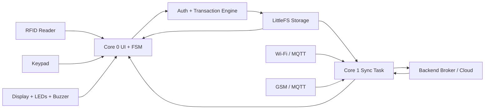
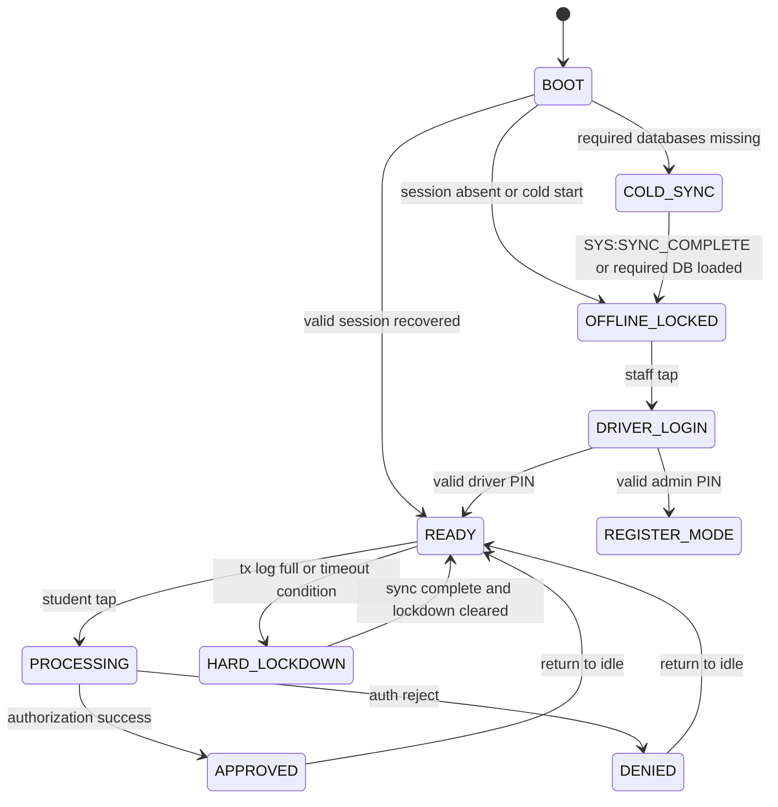

# C-TRANSIT Terminal Architecture

## Executive Overview

C-TRANSIT is an offline-first transit payment terminal built around an ESP32-WROOM-32E running PlatformIO with the Arduino framework and FreeRTOS. The system is designed to remain operational during intermittent connectivity while preserving a durable audit trail of rider transactions in local non-volatile storage until the backend confirms reception.

The firmware architecture follows a dual-core model:
- Core 0 handles user interaction, card reads, keypad logic, display, and state transitions.
- Core 1 handles networking, broker synchronization, OTA orchestration, and background file synchronization.

The operating principle is strict:
1. Record local transactions immediately in LittleFS.
2. Sync those transactions to the cloud as soon as a network path is available.
3. Delete local records only after the broker acknowledges the publish.
4. Apply downlink control data such as whitelist updates, blacklist updates, fare changes, and network-mode changes as soon as they arrive.

---

## 1. System Objectives and Design Constraints

### Primary goals
- Maintain access control even when internet connectivity is unavailable.
- Preserve transaction integrity with append-only local logging.
- Prefer eventual consistency over blocking user experience.
- Support both Wi-Fi and GSM-backed transport paths with deterministic fallback behavior.
- Enforce local authorization rules when connectivity is absent or stale.

### Non-functional constraints
- Deterministic behavior under power loss.
- Small memory and flash footprint.
- Minimal dependence on external services during normal operation.
- Clear separation between UI, transaction logic, and networking.
- Safe recovery after warm reset, cold boot, and interrupted synchronization.

---

## 2. High-Level Architecture



### Core responsibilities

| Subsystem | Responsibility |
|---|---|
| [src/main.cpp](src/main.cpp) | Boot sequence, task creation, top-level loop, UI dispatch, and hardware bring-up |
| [lib/statemachine](lib/statemachine) | Explicit finite state machine for offline and online states |
| [lib/auth](lib/auth) | Local authorization rules, staff login, student validation, and anti-abuse checks |
| [lib/transaction](lib/transaction) | Timestamping and append-only transaction recording |
| [lib/storage](lib/storage) | LittleFS-backed file operations, atomic updates, and tx-log management |
| [lib/sync](lib/sync) | MQTT transport abstraction, Wi-Fi connect, GSM fallback, OTA, and downlink processing |
| [lib/display](lib/display) | LCD rendering and status indication |
| [lib/ui](lib/ui) | LED and buzzer feedback |
| [lib/rfid](lib/rfid) | RFID polling and card detection |
| [lib/keypad](lib/keypad) | PIN capture and keypad scanning |
| [lib/power](lib/power) | Watchdog, reset diagnostics, and power safety |
| [lib/logger](lib/logger) | Structured diagnostic logging |

---

## 3. Hardware Platform and Physical Topology

### Primary platform
- ESP32-WROOM-32E
- PlatformIO target: `espressif32 @ 6.5.0`
- Framework: Arduino core for ESP32 with FreeRTOS tasks

### Key peripherals

| Component | Interface | Notes |
|---|---|---|
| MFRC522 RFID reader | VSPI | CS on GPIO 5, MOSI 23, MISO 19, SCK 18 |
| 16x2 LCD with PCF8574 | I2C | Address 0x27 |
| 4x4 keypad | GPIO matrix | Rows 27,14,26,25; columns 32,33,15,12 |
| Green status LED | GPIO 2 | Approval or active state |
| Red status LED | GPIO 4 | Deny, fault, or lockdown |
| Buzzer | GPIO 13 | Feedback tone |
| Wi-Fi | 2.4 GHz STA mode | Primary bearer |
| GSM modem path | UART2 | SIM800L-style modem transport, configured in [include/config.h](include/config.h) |

### Storage layout
- Persistent storage is LittleFS on internal flash, not SD.
- Partitioning is managed through [partitions.csv](partitions.csv).
- The file system is mounted at `/data` using the littlefs partition name.

---

## 4. Runtime Execution Model

### Two-core software partitioning

#### Core 0 — User and safety plane
- Runs the RFID and UI loop in [src/main.cpp](src/main.cpp).
- Maintains the state machine.
- Handles tap events, staff login, registration, and feedback.
- Monitors system health, including RFID watchdogs and UI refresh.

#### Core 1 — Connectivity and synchronization plane
- Runs [lib/sync/sync.cpp](lib/sync/sync.cpp) as a persistent background task.
- Manages Wi-Fi connection, MQTT session establishment, subscription, and retries.
- Handles OTA dispatch and downlink message parsing.
- Flushes the local transaction queue when connectivity is available.

### Execution policy
- Core 0 prioritizes low-latency, interactive behavior.
- Core 1 prioritizes asynchronous connectivity and synchronization.
- State changes can wake Core 1 with a notification so a transaction or recovery event does not wait for the next timer cycle.

---

## 5. State Machine Architecture

The firmware uses an explicit state machine to avoid ambiguous behavior during offline or degraded conditions.



### Important transition triggers
- `STATE_COLD_SYNC` is entered if required local database files are absent.
- `STATE_HARD_LOCKDOWN` protects the system if the tx log is full or outbound sync has not recovered the terminal within the configured timeout window.
- `STATE_READY` is reached only when the session and local policy data are valid.

---

## 6. Data Model and Persistent Storage

The terminal uses append-only, line-oriented records in LittleFS.

| File | Purpose |
|---|---|
| [include/config.h](include/config.h) | Global configuration, topics, timing, pins, and path definitions |
| `/wl.dat` | Whitelist of approved UIDs |
| `/bl.dat` | Blacklist of denied or revoked UIDs |
| `/drv.dat` | Driver credential database |
| `/adm.dat` | Admin credential database |
| `/tx.log` | Pending transactions to be synchronized |
| `/sess.dat` | Runtime session state |
| `/sync.dat` | Last successful sync timestamp |
| `/temp.log` | Temporary file used during atomic rewrites |

### Transaction record format
Each uplink payload line follows this shape:

```text
TERMINAL_ID:UID,AMOUNT,TIMESTAMP,DRIVER_UID
```

Example:
```text
TERM_01:A1B2C3D4,-200,1708000500,DEADBEEF
```

### Local authority rules
- A tap is checked against the whitelist and blacklist first.
- A transaction is accepted only when the rider is valid and the fare policy allows it.
- The system enforces a soft offline window while network sync remains unavailable.

---

## 7. Sync Architecture

### Sync goals
- Push pending local transactions without user intervention once connectivity exists.
- Pull down control updates such as whitelist and blacklist replacements, fare changes, and network mode changes.
- Preserve ordering and avoid duplicated or dropped transactions.

### Connectivity policy
The system prefers the following network order:
1. Wi-Fi as the primary bearer.
2. GSM fallback when Wi-Fi is unavailable or fails.
3. Retry with failure counters and automatic fallback logic when allowed.

### Wi-Fi path
- Uses `WiFiClientSecure` with insecure validation in this development build.
- On connection, the system triggers an immediate synchronization notification.
- MQTT subscriptions are established after connect.
- The outgoing queue is flushed from [lib/storage/storage.cpp](lib/storage/storage.cpp).

### GSM path
- Uses a serial AT-command interface to the modem.
- Opens GPRS and initiates TCP to the MQTT broker.
- Publishes status and transaction data through a low-level MQTT packet path.
- Sleeps the modem afterwards to minimize battery drain.

### Acknowledge-before-delete policy
This is a critical integrity rule:
- The firmware must not delete a transaction from `/tx.log` until the backend has acknowledged the publish.
- The Wi-Fi path enforces this with a QoS1 publish and PUBACK wait in [lib/sync/sync.cpp](lib/sync/sync.cpp).
- The delete operation is performed only after the ACK is observed.
- The actual rewrite of the tx log is handled by `storage_atomic_delete_sent()` in [lib/storage/storage.cpp](lib/storage/storage.cpp).

### Downlink behavior
The backend can send control messages over the subscribed downstream topic:
- `SYS:FARE,<value>` updates the fare policy.
- `SYS:OTA,<url>` triggers OTA update retrieval.
- `SYS:NET,<mode>` changes network preference.
- `SYS:WL,<uid list>` updates whitelist entries.
- `SYS:BL,<uid list>` updates blacklist entries.
- `SYS:DR,<uid list>` updates driver list.
- `SYS:SYNC_COMPLETE` releases force-sync or cold-sync states.

---

## 7.1 Wire Protocol Reference: Topics and Payload Formats

The MQTT interface is intentionally plain-text and line-oriented. The terminal does not use JSON on the wire.

### Topic map

| Topic | Direction | Purpose | Payload semantics |
|---|---|---|---|
| `ctransit/TERM_01/tx` | Outbound | Transaction and control uplink | Pipe-delimited transaction payloads that are flushed from `/tx.log` |
| `ctransit/TERM_01/rx` | Inbound | Control and policy downlink | Commands that update fares, lists, OTA, network mode, and sync status |
| `ctransit/TERM_01/status` | Outbound | Presence and health | Retained `ONLINE` on connect, `OFFLINE` via LWT |

### Outbound payloads

#### 1. Transaction uplink on `ctransit/TERM_01/tx`
The transaction queue is streamed from `/tx.log` by [lib/storage/storage.cpp](lib/storage/storage.cpp). Each line is prefixed with `TERM_01:` and the payload is pipe-delimited when multiple entries are present.

```text
TERM_01:UID,AMOUNT,TIMESTAMP,DRIVER_UID
```

Example:
```text
TERM_01:A1B2C3D4,-200,1708000500,DEADBEEF
```

Special transaction-like records may also appear, for example:
```text
TERM_01:PENDING_LINK:UID,OTP,AGENT
```

This is the main outbound ledger stream used for backend reconciliation.

#### 2. Presence status on `ctransit/TERM_01/status`
The firmware publishes a retained status value:
- `ONLINE` after a successful MQTT connect
- `OFFLINE` as the Last Will and Testament payload when the client disconnects unexpectedly

Example:
```text
ONLINE
```

### Inbound payloads on `ctransit/TERM_01/rx`

The firmware subscribes to this topic and parses the payload in [lib/sync/sync.cpp](lib/sync/sync.cpp).

#### A. System control commands (reserved `SYS:` format)

| Payload | Meaning | Effect |
|---|---|---|
| `SYS:FARE,-250` | Update fare value | Writes the new fare to the fare config file |
| `SYS:OTA,http://host/path/firmware.bin` | OTA firmware update | Starts firmware download and update over HTTPS |
| `SYS:NET,1` | Network mode override | `0=AUTO`, `1=WIFI_ONLY`, `2=GSM_ONLY` |
| `SYS:SYNC_COMPLETE` | Sync acknowledgement | Marks the last sync complete and clears synchronization pressure |
| `SYS:WL:UID1|UID2|UID3` | Replace whitelist | Overwrites `/wl.dat` with the supplied UIDs |
| `SYS:BL:UID1|UID2|UID3` | Replace blacklist | Overwrites `/bl.dat` |
| `SYS:DR:UID1|UID2|UID3` | Replace driver list | Overwrites `/drv.dat` |
| `SYS:AD:UID1|UID2|UID3` | Replace admin list | Overwrites `/adm.dat` |

#### B. Differential list mutation commands (generic format)
These are parsed from the same topic and allow per-entry mutation commands in a pipe-delimited payload.

```text
ADD:WL,UID1|REM:BL,UID2|ADD:DR,UID3
```

| Command | Meaning |
|---|---|
| `ADD:WL,UID` | Add UID to the whitelist |
| `REM:WL,UID` | Remove UID from the whitelist |
| `ADD:BL,UID` | Add UID to the blacklist |
| `REM:BL,UID` | Remove UID from the blacklist |
| `ADD:DR,UID` | Add UID to the driver list |
| `REM:DR,UID` | Remove UID from the driver list |
| `ADD:AD,UID` | Add UID to the admin list |
| `REM:AD,UID` | Remove UID from the admin list |

### QoS and acknowledgement expectations
- `ctransit/TERM_01/tx` is sent with QoS 1 semantics on the Wi-Fi path, and the firmware waits for a PUBACK before removing synced records from `/tx.log`.
- `ctransit/TERM_01/status` is retained and used for presence monitoring.
- `ctransit/TERM_01/rx` is the command channel and must be treated as authoritative for control-plane updates.

---

## 8. Security and Safety Model

### Practical security boundaries
- The local policy database is stored in LittleFS and loaded during runtime.
- Staff authentication is performed using local PIN validation against stored driver/admin data.
- The terminal does not trust network state alone; it uses local policy and sync timestamps to determine when a lockout can be cleared.
- MQTT credentials are stored in [include/config.h](include/config.h).

### Safety behaviors
- If `tx.log` reaches its line cap, the terminal transitions to hard lockdown.
- If the terminal has not synced within the configured timeout window, access may be denied or locked down.
- A failed or untrusted sync does not erase local tx history.

---

## 9. Failure Handling and Recovery

| Failure | Expected behavior |
|---|---|
| No connectivity | Continue local authorization using cached policy data |
| Wi-Fi association fails | Fall back to GSM if allowed by the configured network mode |
| MQTT broker unavailable | Retain tx log and retry on the next wake-up or event |
| Power loss during write | Append-only semantics preserve the latest valid log line |
| Interrupted sync | Old tx records remain queued until a successful ACK |
| OTA update failure | Leave firmware unchanged and continue operation |
| Missing database on boot | Enter `COLD_SYNC` and wait until the required data arrives |

---

## 10. Build, Deployment, and Operations

### Build prerequisites
```bash
pip install platformio
```

### Seed the local filesystem
```bash
pio run --target uploadfs
```

### Flash firmware
```bash
pio run --target upload
```

### Monitor telemetry
```bash
pio device monitor --baud 115200
```

### Suggested production deployment checklist
1. Provision the correct Wi-Fi SSID/password and broker credentials.
2. Populate [data/drv.dat](data/drv.dat) and [data/adm.dat](data/adm.dat) with production IDs.
3. Upload the LittleFS image before the first firmware flash.
4. Verify that `/tx.log` starts empty and `/sync.dat` is seeded correctly.
5. Confirm that the system enters `COLD_SYNC` only when the whitelist or driver database is absent.
6. Validate that a failed publish does not remove local tx entries.
7. Validate that a successful publish followed by PUBACK removes the synced prefix.

---

## 11. Recommended Engineering Notes

- The architecture is intentionally conservative: it favors durable local records and delayed deletion until broker confirmation.
- The dual-network design is suitable for campus deployments where connectivity is intermittent but availability must not stop fare enforcement.
- The use of line-oriented plaintext records allows straightforward debugging and offline forensics.
- The codebase should remain careful about heap pressure during encryption and OTA, especially when using secure transport paths.

---

## 12. Summary

C-TRANSIT is a resilient, offline-first transit terminal with a deterministic state machine, a persistent transaction ledger, and a dual-network synchronization engine. Its core principle is that local transactions are not trusted to be safely transmitted until a backend acknowledgement confirms delivery. This makes the platform suitable for unattended operation in environments where network reliability is inconsistent but transaction integrity is non-negotiable.
